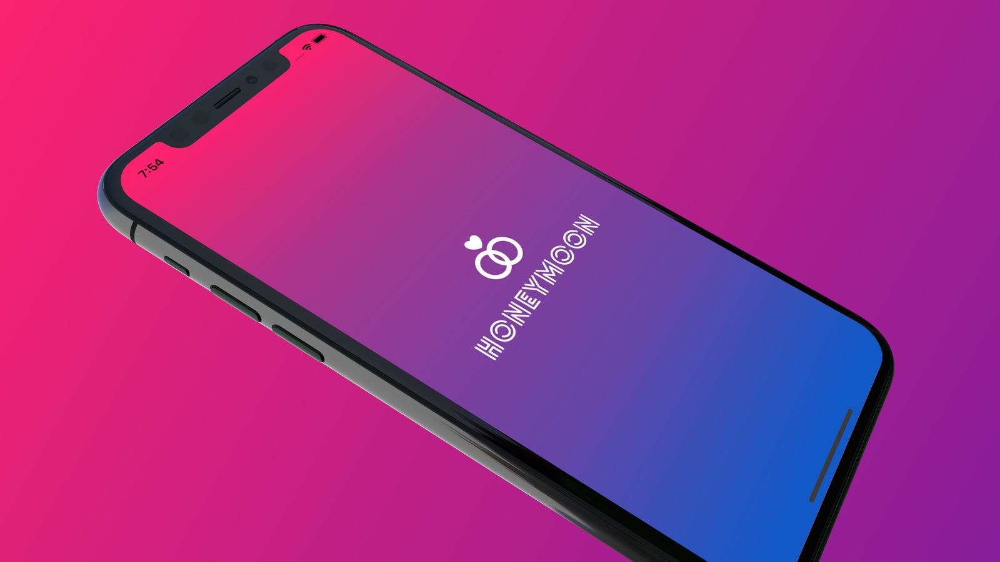
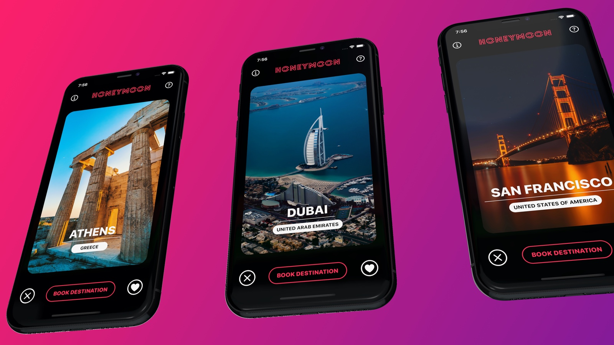
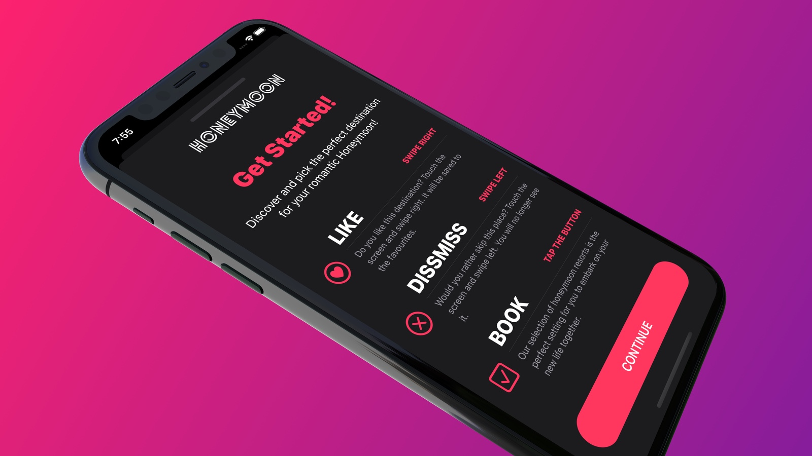

# SwiftUI 2 - Honeymoon
 

  How hard is it to create an iOS app with Tinder-like gestures? You will pick up some handy SwiftUI best-practices with this hands-on tutorial.

  

  What we're going to do in this SwiftUI tutorial? We will build a gorgeous iOS 15 and iPadOS app with a Tinder-like user interface design. Since <b>swipe motion is quite a popular mobile UI pattern</b> nowadays. That's why we're going to dive into gestures with SwiftUI in this section. The app presents users with a pile of Honeymoon destination cards and allows them to use the swipe gesture to like or dislike a card.

  

  In this tutorial, we're going to develop an awesome iOS/iPadOS app with <b>SwiftUI drag gestures in Xcode.</b> This could be a great portfolio app that you can show up with confidence in your job interview.

  

## Topics are covered:

- [x] Let's set up the Honeymoon app, an iOS/iPadOS 15 project in Xcode 13.
- [x] Let's create a Launch Screen for the project
- [x] How to build up the layout of the individual Honeymoon Card view
- [x] Let's develop the Header layout of the Honeymoon App with SwiftUI
- [x] Let's develop the Footer layout of the Honeymoon App with SwiftUI
- [x] How to create reusable components and write less code with SwiftUI
- [x] Let's create a new view for the guides of Honeymoon App
- [x] How does binding work with SwiftUI?
- [x] Show views with Binding and dismiss view with Environmental objects
- [x] Let's create a new view for the credits and app info
- [x] Show views with Binding and dismiss view with Environmental objects (exercise)
- [x] Let's implement the card deck with a computed property
- [x] How to implement the Swiping Motion with SwiftUI
- [x] Let's display the Heart and X-mark symbols during the swiping
- [x] How to remove and insert the cards
- [x] Enhancing the animation with custom transitions with SwiftUI
- [x] Implementing haptic feedback (success) and playing sound effects

## Custom iOS 15 and iPadOS mobile app icon

  
  

    App icon
  

## Meta

Tin Tran – [Linkedin](https://www.linkedin.com/in/realtrantrungtin) – realtrantrungtin@gmail.com
